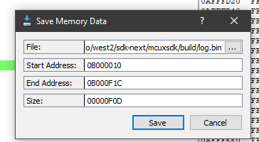
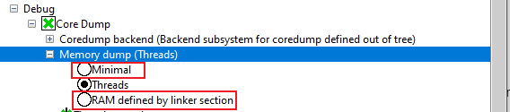

# coredump_fault

## Overview
The coredump_fault example demonstrates the basic usage of debug/coredump component.

In this example, a Usagefault is intentionally triggered using a division-by-zero operation. 
The fault is then captured in the UsageFault_Handler, where the cause of the fault, the current 
Exception Stack Frame (ESF), and partial RAM contents are saved to flash memory using the coredump component.
 
Afterward, a software reset is triggered. Upon reboot, the fault’s cause is analyzed using the API provided by the coredump component.

Please note that only flash targets are supported!

## Running the demo
Note: Once the program is download to the target board, please press Reset Button to reset program.

Expected log:  
```
    Coredump Fault Example Start!
    Press any key to trigger usagefault...
    Coredump Fault Example Rebooted!!!
    Press any key to check coredump reason...
    [Info] Size: 3894.
    [Info] Reason: Usagefault caused by an integer divsion by zero!
```

## How to debug
1. Download the program and press SW1 to reset the program.
   Following log will be observed in terminal:    
        Coredump Fault Example Start!
        Press any key to trigger usagefault...
2. Attach to running target with debugger.
3. Press any key in terminal.

## Use GDB server to examine core dump data.
> This feature is verified on armgcc toolchain.
1. Save the data with an offset of 0x10 from the coredump flash partition(Define in `CONFIG_MFLASH_COREDUMP_REGION_START_ADDR`) into a binary file (e.g., log.bin).
    > Note: The offset should be 0x10. Otherwise ***[ERROR][parser] Log header ID not found...*** will reported.  
    > Note: Recommend to use Ozone. 

    
2. Start the custom GDB server using the script [coredump_gdbserver.py](../../../components/debug/coredump/scripts/coredump_gdbserver.py) with the core dump binary log file(saved in step 1) and example elf file as pararmeters:   
    `python ../components/debug/coredump/scripts/coredump_gdbserver.py coredump_fault.elf log.bin --port=2331`
3. Start GDB:  
    `arm-none-eabi-gdb.exe .\coredump_fault.elf`
4. Inside GDB, connect to the GDB server via port 2331:  
    `(gdb) target remote localhost:2331`  
    Output from GDB Client:
    ```
    Remote debugging using localhost:2331
    0x080051d8 in DEMO_TriggetUseFault () at C:/Arepo/west2/sdk-next/mcuxsdk/examples/component_examples/coredump_fault/coredump_fault.c:152
    152         x = x / y;
    ```
5. Examine the Core registers:  
    `(gdb) info registers`
    Output from GDB Client:
    ```
    r0             0x61                97
    r1             0x200033b8          536884152
    r2             0x0                 0
    r3             0x1                 1
    r4             0x0                 0
    r5             0x0                 0
    r6             0x0                 0
    r7             0x0                 0
    r8             0x0                 0
    r9             0x0                 0
    r10            0x0                 0
    r11            0x0                 0
    r12            0x12121212          303174162
    sp             0x20003398          0x20003398 <ucHeap+2136>
    lr             0x80051f3           134238707
    pc             0x80051d8           0x80051d8 <DEMO_TriggetUseFault+40>
    xpsr           0x61000000          1627389952
    ```
6. Examine the backtrace:  
    `(gdb) bt`
    Output from GDB Client:
    ```
    #0  0x080051d8 in DEMO_TriggetUseFault () at C:/Arepo/west2/sdk-next/mcuxsdk/examples/component_examples/coredump_fault/coredump_fault.c:152
    #1  0x080051f2 in DEMO_FaultTriggerTask (parameters=<optimized out>) at C:/Arepo/west2/sdk-next/mcuxsdk/examples/component_examples/coredump_fault/coredump_fault.c:73
    #2  0x00000000 in ?? ()
    Backtrace stopped: previous frame identical to this frame (corrupt stack?)
    ```
7. Query thread info:
    `(gdb) info threads`
    Output from GDB Client:
    ```
    Id   Target Id                                                                      Frame 
    * 1    Thread 1 (name: )                                                              0x080051d8 in DEMO_TriggetUseFault ()
        at C:/Arepo/west2/sdk-next/mcuxsdk/examples/component_examples/coredump_fault/coredump_fault.c:152
    2    Thread 2 (name: DEMO_MainTask, state: 0x80, user_options: 0x0, prio: 0x3)      <unavailable> in ?? ()
    3    Thread 3 (name: DEMO_FaultTriggerTa, state: 0x0, user_options: 0x0, prio: 0x3) <unavailable> in ?? ()
    4    Thread 4 (name: IDLE, state: 0x80, user_options: 0x0, prio: 0x0)               <unavailable> in ?? ()
    5    Thread 5 (name: Tmr Svc, state: 0x2, user_options: 0x0, prio: 0x4)             <unavailable> in ?? ()
    ```

## Update default settings
This example defaults to dumping thread structure and stacks of all threads, and user can switch to other memory type
by change "Memory dump" option in Kconfig. 


## Supported Boards
- [FRDM-RW612](../../_boards/frdmrw612/component_examples/coredump_fault/example_board_readme.md)
- [FRDM-MCXW71](../../_boards/frdmmcxw71/component_examples/coredump_fault/example_board_readme.md)
