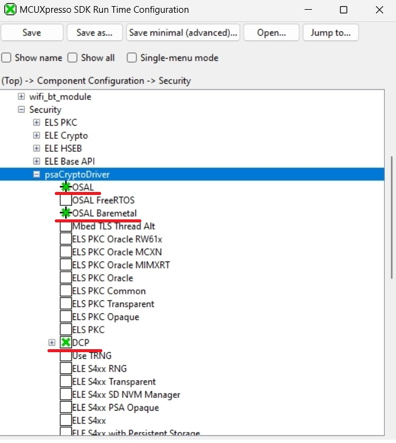
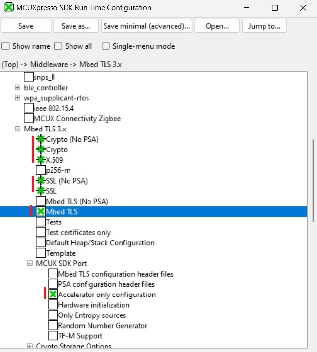
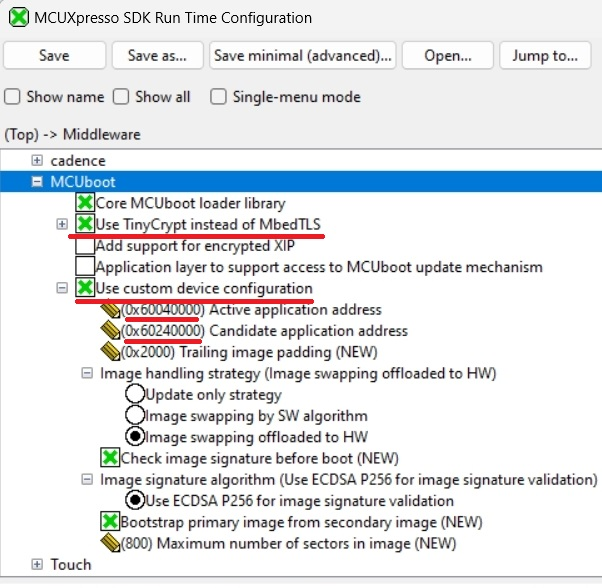

# Kconfig and customization of OTA examples

The OTA examples supports alternative way to adjust default project settings using Kconfig. For more information related to Kconfig please see [MCUXpresso SDK documentation](https://mcuxpresso.nxp.com/mcuxsdk/latest/html/introduction/README.html)

## Encrypted XIP mode

This is one of the ways to build and evaluate projects configured for Encrypted XIP mode. For more information please see [Encrypted XIP and MCUboot](encrypted_xip_readme.md).

The following walkthrough for EVKBMIMXRT1060 and IAR toolchain demonstrates how to enable Encrypted XIP mode. 

1. Build GUI configuration

~~~
west build -p always examples/ota_examples/mcuboot_opensource --toolchain iar --config flexspi_nor_release -b evkbmimxrt1060 -t guiconfig -d builds/evkbmimxrt1060_mcuboot

~~~
2. Modify settings in Middleware->MCUboot
    * enable `Add support for encrypted XIP` and `Use custom device configuration`
    * enable `Enable Encrypted XIP mode`
    * fill addresses of active and candidate application and meta data - default values from `flash_partioning.h` or board readme for `mcuboot_opensource` can be re-used

3. Click Save and close the window.
4. Navigate to folder with generated project and run
~~~
west build -t guiproject

~~~

Note: `-t guiproject` is optional for IAR toolchain to generate IDE project.

## MCUboot and Crypto backend selection

MCUboot in the SDK supports these crypto backend options:

   1. __TinyCrypt__
      * lightweight crypto library for resource-constrained devices
      * full support of features
   2. __Mbed TLS using legacy API__
      * only built-in implementation (no hardware crypto accelerators)
      * full support of features
   3. __Mbed TLS using PSA Crypto API__
      * support hardware crypto accelerators (requires PSA driver)
      * currently not compatible with Encrypted XIP mode as encrypted image is not supported by PSA API in current MCUboot version

By default, TinyCrypt is used for memory-constrained NXP devices such as MCXN (bootloader in IFR region), MCXA, and MCXE. Other NXP devices with external flash memory typically use Mbed TLS with PSA to utilize hardware acceleration of crypto algorithms. If the Encrypted XIP feature is enabled, the Mbed TLS API switches to the legacy API. 

Since Mbed TLS using the legacy API has only software implementation of crypto functions, it may be desirable to replace Mbed TLS with TinyCrypt to reduce the memory footprint of MCUboot. The same applies in the opposite direction when replacing TinyCrypt with Mbed TLS using the PSA Crypto API.

The following walkthrough demonstrates how to replace Mbed TLS with TinyCrypt. The example is for EVKBMIMXRT1060 and IAR toolchain.

1. Build GUI configuration

~~~
west build -p always examples/ota_examples/mcuboot_opensource --toolchain iar --config flexspi_nor_release -b evkbmimxrt1060 -t guiconfig -d builds/evkbmimxrt1060_mcuboot

~~~

2. Remove any PSA Crypto driver occurences in Component Configuration->Security, eventually related drivers in Driver Configuration
    

3. Remove Mbed TLS middleware and all related components

4. Enable TinyCrypt and custom device configuration in MCUboot configuration

5. Click Save and close the window.
6. Navigate to folder with generated project and run
~~~
west build -t guiproject

~~~

Note: `-t guiproject` is optional for IAR toolchain to generate IDE project.

This way the size of the MCUboot application results in a final size of approximately 30kB.