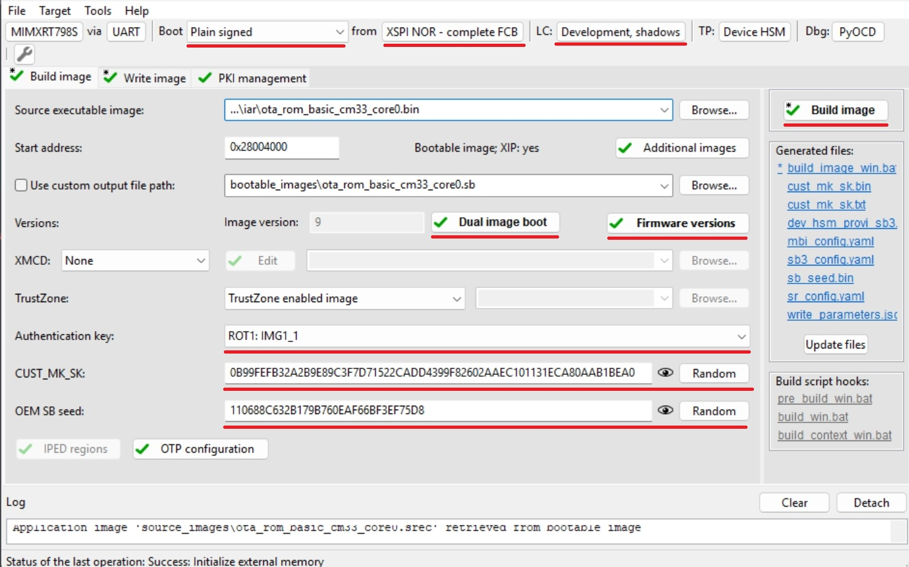
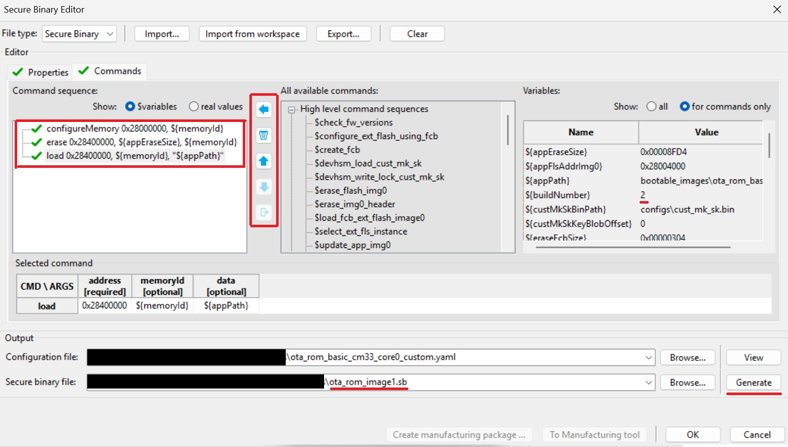
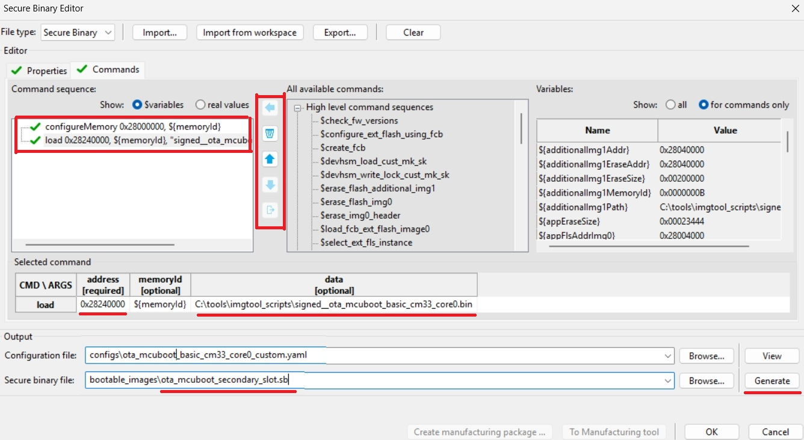

# RT7xx - OTA update by using SB3 file

- [RT7xx - OTA update by using SB3 file](#RT7xx-ota-update-by-using-sb3-file)
   * [1. Provision the device](#1-provision-the-device)
   * [2. Prepare OTA images](#2-prepare-ota-images)
      + [2.1 ROM bootloader only use case](#21-rom-bootloader-only-use-case)
      + [2.2 MCUboot bootloader use case](#22-mcuboot-bootloader-use-case)
   * [3. Firmware update](#3-firmware-update)
      + [3.1 ROM bootloader only use case](#31-rom-bootloader-only-use-case)
      + [3.2 MCUboot bootloader use case](#32-mcuboot-bootloader-use-case)
   * [Supported Boards](#supported-boards)

In this walkthrough, if possible, the lifecycle of the device is not changed for development purposes, so the device can be restored to its initial state. In real scenarios, transitioning the chips to the corresponding lifecycle is based on specific requirements.

Common information related to SB3 is available in the documentation ['OTA update by using SB3 file'](sb3_common_readme.md).

## 1. Provisioning of the device - initial setup

The device must be provisioned to support SB3 processing. To simplify the workflow, the MCUXpresso Secure Provisioning Tool (SEC tool) is used. 

RT7xx family supports shadow registers to process SB3 files for development purposes, so there is no need to advance lifecycle.

To provision the device perform the following steps:

1. Erase the device
2. Build `mcuboot_opensource`+`ota_mcuboot_basic` or `ota_rom_basic` project depending what you want to evaluate
3. Get the device into ISP mode 
    * Typically on development boards hold the ISP button and press the reset button
4. Open the SEC tool and create new workspace for RT7xx target device
    * Test the ISP connection in SEC tool (__Target__ -> __Connection...__)
    * Setup and test debug probe (__Target__ -> __Debug Probe...__)
5. Switch to PKI management tab
    * Click __Generate keys__ (leave default settings) and then switch back to Build image tab

6. (Optional) Let ROM generate FCB
    * __Target__ -> __Boot Memory__ (or CTRL+B)
    * Select __Boot memory type__ -> __XSPI NOR - simplified__
    * Click __Convert to complete FCB__, check option __Apply the converted FCB as the boot device configuration__ and then click __Convert__

7. Initial setup
    * Boot: __Plain signed__
        * Note: Uncheck option with replacing FCB, if you proceeded the step 6
    * Lifecycle: __Develop, shadows__
    * Select an __authentication key__ and generate __CUST_MK_SK__ and __OEM SB seed__
    * For MCUboot use case: 
        * Select `mcuboot_opensource` output binary or ELF image as __Source executable image__
        * Click __Additional images__
        * Check Image 1 and set a path to an image of signed application `ota_mcuboot_basic`
        * Note: This initial image has to be generated with additional __`--pad --confirm`__ imgtool arguments
        * Set __Target address__ `0x28040000` (see `flash_partitioning.h`) to place this initial image in primary slot
    * For ROM only use case:
        * Select `ota_rom_basic` output binary or ELF image as __Source executable image__
        * Click __Dual image boot__
        * Set __Target dual boot image__ to __Image 0__
        * Set __Image 1 offset__ to __0x400000__ (4MB)
        * Set __Image 1 size__ to __Same as offset__
        * Click OK
        * Click __Firmware versions__
        * Set initial image firmare version __1__ (this number is evaluated by ROM during boot when selecting the image with the highest version)
        * Click OK
    * Click __Build image__

8. Write image tab
    * Click __Write image__

9. Switch boot from ISP to normal boot (XSPI0) and soft reset the board

Now the device is provisioned with __RKTH__ and __CUST_MK_SK__ using shadow registers without transition of the lifecycle. The shadow registers are preserved and re-initiated during soft reset (without power-cycle). 

## 2. Prepare OTA images

RT7xx uses flash remapping feature using overlay mechanism (see ['MCUboot and flash remapping feature'](flash_remap_readme.md)). For this reason we have to prepare an ota image targeting currently inactive image slot. Following steps assume that primary slot (or image 0) is active and we have to prepare an OTA image targeting second slot (or image 1)

### 2.1 ROM only use case

Flash memory layout with 4MB image offset looks like this:

| **Partition** | **offset** | **size**   |
|---------------|------------|------------|
| **FCB**       | 0x28000000 | 0x004000   |
| **Image 0**   | 0x28004000 | 0x400000   |
| **Image 1**   | 0x28400000 | 0x400000   |

1. Switch to Build Image tab
2. Increase image version using __Firmware versions__ to number 2 and click __Build image__
3. Open __Tools__ -> __SB Editor__ (CTRL + E)
    * Click __Import from workspace__ to initialize an template for adjustment
    * Rework command sequence into these commands:
        * __configureMemory__ - configAddress: 0x28000000 memoryId: $memoryId
        * __erase__ - configAddress: 0x28400000 size: $(appEraseSize) memoryId: $memoryId
        * Note: __erase__ command, depending on erase size, is a blocking process and could leave the device in an unresponsive state for a longer period of time. It's recommended to let the application the erase before processing OTA SB file.
        * __load__ - configAddress: 0x28400000 memoryId: memoryId data: ${appPath}
    * Change name of secure binary file to `ota_rom_image1.sb`
    * Click __Generate__

* Same steps can be used for an ota image targetting the image 0 slot with these adjustments:
    * Image version has to be higher than active one in the image 1 slot
    * configAddress: 0x28004000

### 2.2 MCUboot bootloader use case

Flash memory layout according settings in `flash_partitioning.h` should look like this:

| **Partition**      | **offset** | **size**   |
|--------------------|------------|------------|
| **FCB + MCUBOOT**  | 0x28000000 | 0x040000   |
| **Primary slot**   | 0x28040000 | 0x200000   |
| **Secondary slot** | 0x28240000 | 0x200000   |

1. Switch to Build Image tab
2. Sign `ota_mcuboot_basic` using `imgtool` with higher image version as usual by following steps in specific `example_board_readme.md` for your board.
3. Open __Tools__ -> __SB Editor__ (CTRL + E)
    * Click __Import from workspace__ to initialize an template for adjustment
    * Rework command sequence into these commands:
        * __configureMemory__ - configAddress: 0x28000000 memoryId: $memoryId
        * __erase__ - configAddress: 0x28400000 size: 0x200000 memoryId: $memoryId
        * Note: __erase__ command, depending on erase size, is a blocking process and could leave the device in an unresponsive state for a longer period of time. It's recommended to let the application the erase before processing OTA SB file.
        * __load__ - configAddress: 0x28240000 memoryId: memoryId data: path to signed `ota_mcuboot_basic`
    * Change name of secure binary file to `ota_mcuboot_secondary_slot.sb`
    * Click __Generate__

* Same steps can be used for an ota image targetting the primary slot with these adjustments:
    * Image version has to be higher than active one in the secondary slot
    * configAddress: 0x28040000

## 3. Firmware update

For demonstration purpose we use [ExtraPutty](https://sourceforge.net/projects/extraputty/) tool as this fork of classic Putty has XMODEM support. Alternatively [TeraTerm](https://teratermproject.github.io/index-en.html) can be used.

Note: Keep in mind that hard reset invalidates shadow registers.

### 3.1 ROM bootloader only use case

1. Run the initial `ota_rom_basic` application

2. Check image state and active flag location with `image` command
    * See active flag location to specify inactive image slot

3. Send the OTA image
    * Run `xmodem_sb3` command
    * Send `ota_rom_image1.sb` targetting inactive slot via __Files Transfer/Xmodem (1k)__ 

4. Reboot the device with `reboot` command

5. Check image update with `image` command

Here is an example of serial output:
~~~

*************************************
* Basic ROM application example     *
*************************************

$ image
Flash REMAP_OVERLAY disabled
IMAGE 0:
    <IMG_VERSION 0x1 LENGTH 36820 EXEC_ADDR 0x28004000>
    *ACTIVE*
IMAGE 1: Invalid image header
$ xmodem_sb3
Started xmodem processing SB3
Initiated XMODEM-CRC transfer. Receiving... (Press 'x' to cancel)
CCCC
Received 42880 bytes
SB3 has been processed
$
$ reboot
System reset!

*************************************
* Basic ROM application example     *
*************************************

$ image
Flash REMAP_OVERLAY active
IMAGE 0:
    <IMG_VERSION 0x1 LENGTH 36820 EXEC_ADDR 0x28004000>
IMAGE 1:
    <IMG_VERSION 0x2 LENGTH 36820 EXEC_ADDR 0x28004000>
    *ACTIVE*
$
~~~

### 3.2 MCUboot bootloader use case

1. Run the initial `ota_mcuboot_basic` application

2. Check image state and active flag location with `image` command
    * See active flag location to specify inactive image slot

2. Erase inactive slot with `image erase` command
    * Note: not needed if the SB file contains the erase command 

4. Send the OTA image
    * Run `xmodem_sb3` command
    * Send `ota_mcuboot_secondary_slot.sb` targetting inactive slot via __Files Transfer/Xmodem (1k)__ 

5. Mark installed image ready for test
    * Run `image test` command

6. Reboot the device with `reboot` command

7. Check image update with `image` command

8. Mark the updated slot with confirm flag using `image accept` and check the state again with `image` command again

~~~
hello sbl.
Bootloader Version 2.2.0
Primary   slot: version=1.0.0+1000
Image 0 Secondary slot: Image not found
Image 0 loaded from the primary slot
Bootloader chainload address offset: 0x40000
Reset_Handler address offset: 0x40400
Jumping to the image

Booting the primary slot - flash remapping is disabled

*************************************
* Basic MCUBoot application example *
*************************************

Built Oct  3 2025 20:33:10
Toolchain IAR ANSI C/C++ Compiler V9.70.1.475/W64 for ARM

$ image
Image 0; name APP; state None:

  Slot 0 APP_PRIMARY; offset 0x40000; size 0x200000 (2097152):
    <IMAGE: size 42421; version 1.0.0+1000>
    SHA256 of image payload: E069B6127A708EE88B39...
    log_addr 0x28040000
    *ACTIVE*

  Slot 1 APP_SECONDARY; offset 0x240000; size 0x200000 (2097152):
    <No Image Found>

$ image erase
Erasing inactive slot...done
$ xmodem_sb3
Started xmodem processing SB3
Make sure this device is provisioned to accept secure binary and its load address is 0x240000
Initiated XMODEM-CRC transfer. Receiving... (Press 'x' to cancel)
CCCCC
Received 51200 bytes
SB3 has been processed
$
$ image test
write magic number offset = 0x43ff00
$ reboot
System reset!
hello sbl.
Bootloader Version 2.2.0
Primary   slot: version=1.0.0+1000
Secondary slot: version=1.1.0+1000
writing copy_done; fa_id=1 off=0x1fffe0 (0x43ffe0)
Image 0 loaded from the secondary slot
Bootloader chainload address offset: 0x240000
Reset_Handler address offset: 0x240400
Jumping to the image

Booting the secondary slot - flash remapping is enabled

*************************************
* Basic MCUBoot application example *
*************************************

Built Oct  3 2025 20:33:10
Toolchain IAR ANSI C/C++ Compiler V9.70.1.475/W64 for ARM

$ image
Flash REMAP_OVERLAY active.

Image 0; name APP; state Testing:

  Slot 0 APP_PRIMARY; offset 0x40000; size 0x200000 (2097152):
    <IMAGE: size 42421; version 1.0.0+1000>
    SHA256 of image payload: E069B6127A708EE88B39...
    log_addr 0x28040000 remaps to 0x28240000

  Slot 1 APP_SECONDARY; offset 0x240000; size 0x200000 (2097152):
    <IMAGE: size 42421; version 1.1.0+1000>
    SHA256 of image payload: E069B6127A708EE88B39...
    log_addr 0x28240000 remaps to 0x28240000
    *ACTIVE*

$ image accept
$ image
Flash REMAP_OVERLAY active.

Image 0; name APP; state Permanent:

  Slot 0 APP_PRIMARY; offset 0x40000; size 0x200000 (2097152):
    <IMAGE: size 42421; version 1.0.0+1000>
    SHA256 of image payload: E069B6127A708EE88B39...
    log_addr 0x28040000 remaps to 0x28240000

  Slot 1 APP_SECONDARY; offset 0x240000; size 0x200000 (2097152):
    <IMAGE: size 42421; version 1.1.0+1000>
    SHA256 of image payload: E069B6127A708EE88B39...
    log_addr 0x28240000 remaps to 0x28240000
    *ACTIVE*

$
~~~

## Supported Boards

- [MIMXRT700EVK](../../_boards/mimxrt700evk/ota_examples/mcuboot_opensource/example_board_readme.md)